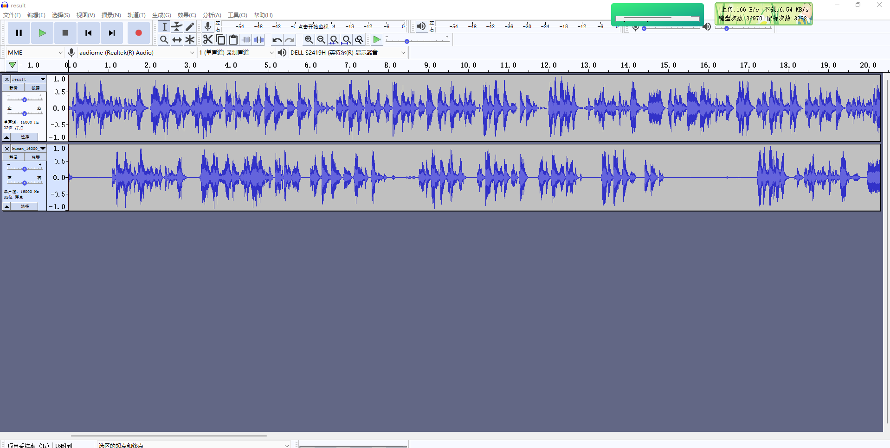

# webrtc-vad

## webrtc vad模块简介
vad是语音活动检测模块，webrtc使用的基于GMM的检测算法，支持8/16/24/32/48kHz采样率


## 1. 程序主要用到的api及功能如下:
1. 创建vad模块
```
VadInst* WebRtcVad_Create();
```

2. 初始化vad模块

```
int WebRtcVad_Init(VadInst* handle); 
```
3. 设置模式
    主要支持以下模式：
		 1 通用模式
		 2 比特率模式
		 3 激进模式
		 4 非常激进模式
```
 WebRtcVad_set_mode(VadInst* handle, int mode);
```
4. 处理函数
```
WebRtcVad_Process(VadInst* handle, int sampleRate, const int16_t* audio_frame, size_t frame_length);
```

frame_length计算方式
```
  static const int kValidRates[] = { 8000, 16000, 32000, 48000 };
  static const int kMaxFrameLengthMs = 30;
  for (valid_length_ms = 10; valid_length_ms <= kMaxFrameLengthMs; valid_length_ms += 10){
	  valid_length = (size_t)(kValidRates[i] / 1000 * valid_length_ms);
}
```
	采样率16000：
		frame_length可以分别设置成160 320 480
	采样率48000:
 		frame_length可以分别设置成480 960 1440
    处理音频buffer， 处理过的数据还存储在audio_frame中

5. 释放句柄
```
WebRtcVad_Free(VadInst* handle);
```
  
## 2. 主要程序
```
#include <stdio.h>
#include <stdlib.h>
//webrtc
#include "common_audio/vad/include/webrtc_vad.h"

#define MAX_FRAME_SIZE 160
#define NEW_LINE 30
#define SILENCE_STEP 50

//帮助函数
int help(char *argv[])
{
    printf("please input a pcm file like:%s a.pcm samplerate framesize silencestep\n", argv[1]);
    return -1;
}

int main(int argc, char* argv[])
{
    if(argc < 2){
        return help(argv);
    }
    
    //每次塞入buffer大小
    int frameSize = MAX_FRAME_SIZE;
    //静音检测，间隔多少个silence才舍弃当前音频段
    int silenceStep = SILENCE_STEP;
    //采样率
    short sampleRate = 16000;

    if(argc == 3) sampleRate = atoi(argv[2]);
    if(argc == 4) frameSize = atoi(argv[3]);
    if(argc == 5) silenceStep = atoi(argv[4]);
    FILE *fpin = NULL, *fpout = NULL, *fpbf = NULL;
    VadInst *handle = NULL;
    
    short *frame = (short*)malloc(frameSize*sizeof(short));
    int status = 0;

    // 创建句柄
    handle = WebRtcVad_Create();
    if(handle == NULL){
        printf("webrtc vad create error%d\n", status);
        return status;
    }

    // 初始化vad
    status = WebRtcVad_Init(handle);
    if(status){
        printf("webrtc vad init error:%d\n", status);
        return status;
    }

    // 设置mode
    status = WebRtcVad_set_mode(handle, 3);
    if(status){
        printf("webrtc vad mode set error:%d\n", status);
        return status;
    }

    fpin = fopen(argv[1], "rb");
    fpout = fopen("result.txt", "w");
    fpbf = fopen("result.pcm", "wb");
    int inx = 0;
    int cursen = 0, presen = 0;
    int step = 0;
    
    FILE *fpelber = NULL;

    if(fpin != NULL){
        while(!feof(fpin)){
            int len = fread(frame, sizeof(short), frameSize, fpin);
            if(len > 0){
                inx++;
                printf("index:%d len:%d sizeof(short):%ld\n", inx, len, sizeof(short));
                // 处理pcm数据
                status = WebRtcVad_Process(handle, sampleRate, frame, len);
                if(status == -1){
                    printf("webrtc vad process is error:%d\n", status);
                    printf("frames:%d\n", inx);
                    return status;
                }else if(status == 1){
                    if(step > 50 || cursen == 0) {
                        if(fpelber != NULL){
                            fclose(fpelber);
                            fpelber = NULL;
                        }
                        char sentense[24];
                        sprintf(sentense, "sentence_%d.pcm", cursen);
                        //  打开新的sentence 句子 
                        fpelber = fopen(sentense, "wb");
                        printf("new sentence:%d\n", cursen++);
                    }

                    step = 0;

                    //  写入处理过的数据
                    fwrite(frame, sizeof(short), len, fpbf);
                    fwrite(frame, sizeof(short), len, fpelber);
                }else{
                    step++;
                }
                if(inx % NEW_LINE == 0)fprintf(fpout, "%02d\n", status);
                else fprintf(fpout, "%02d ", status);
            }
        }
    }
    free(frame);
    frame = NULL;

    printf("frames:%d\n", inx);
    if(fpin != NULL)fclose(fpin);
    fclose(fpout);
    fclose(fpbf);

    //  释放句柄
    WebRtcVad_Free(handle);
    return 0;
}
```
## 3. 编译程序
```
cmake -GNinja -Bbuild_ninja
cmake --build build_ninja
```
## 4. 测试程序
```
./build_ninja/simple_buffer_cut ./data/human_16000_s16le_1.pcm
```
## 5. 使用Audacity查看波形图并播放
```
使用audacity导入原始pcm文件
```
效果如下：处理过后的在上面，原始数据在下面


## 源码路径
[webrtc vad 源码路径](https://github.com/holylong/webrtc-vad)